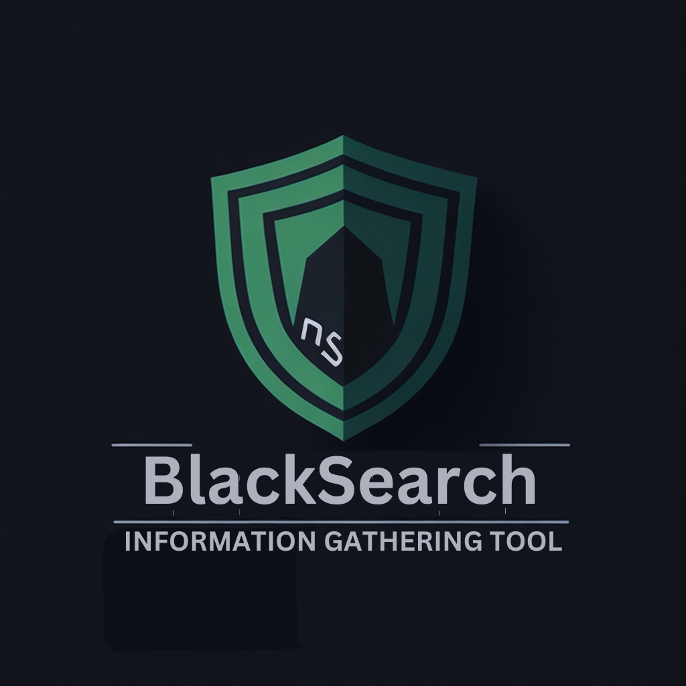
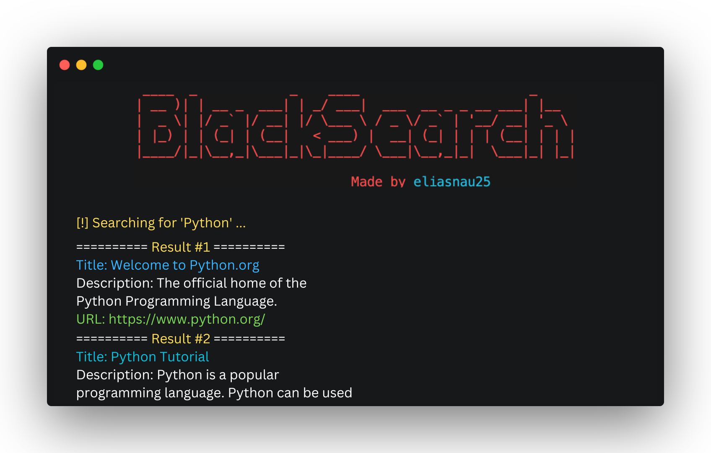

<h1>Blacksearch</h1>

### An OSINT tool to search fast for Google in the Terminal, Get data from IP Adresses like Geolocation and Service Privider.
> BlackSearch is a powerful OSINT tool that provides IP address information, Google searches, website vulnerability analysis, data breach checks, and domain exploration. Use it responsibly and always seek permission before using it against others.

</br>



## Disclaimer
This program is for educational purposes ONLY. Do not use it against individuals or systems without proper authorization and explicit permission. The author (eliasnau25) does not endorse any illegal or unethical activities with this software. Use it responsibly, respecting the privacy and rights of others. Any misuse or unauthorized use is strictly prohibited and may have legal consequences.

## Setup

#### Clone the repository
```shell
git clone https://github.com/eliasnau25/blacksearch
cd blackbird
```

#### Install requirements
```shell
pip install -r requirements.txt
```
## Usage

#### Perform a normal google search in your terminal
```python
python blackbird.py --google -q <query>
```
Optional Arguments:
```python
-r <max-results>    #The maximum amount of results to display
-s <site>   #Only search on a specific website
-t <filetype>    #Only search for a specific file type
```
Example:
```python
#Input:

python blacksearch.py --google -q "Python documentation" -r 10 -t "pdf"

#Output:
Searching for 'site:"python.org" Python documentation'...
========== Result #1 ==========
Title: Python Docs
Description: Python 3.11.4 documentation. Welcome! This is the official documentation for Python 3.11.4. Parts of the documentation: ...
URL: https://docs.python.org/ 

========== Result #2 ==========
Title: Our Documentation | Python.org
Description: Browse the docs online or download a copy of your own. Python's documentation, tutorials, and guides are constantly evolving. Get started here, or scroll ...
URL: https://www.python.org/doc/ 

========== Result #3 ==========
Title: The Python Tutorial — Python 3.11.4 documentation
Description: Python is an easy to learn, powerful programming language. It has efficient high-level data structures and a simple but effective approach to ...
URL: https://docs.python.org/3/tutorial/index.html 

Search completed in 3.53 seconds. Found 3 results.
```

#### Perform an IP-Search
```python
python blacksearch.py --ip -q <ip-adress> # You can provid an Ip-4 Ip-6 or a domain
```
Optional Arguments:
```python
none
```

Example:
```python
#Input:

python blacksearch.py --ip -q "google.com"

#Output:
========== google.com ==========
Country: United Kingdom
Region: England
City: London
Lat: 51.5072, Lon: -0.127586
zip: W1B
Service Provider: Google LLC

Search completed in 0.33 seconds
```

#### More Features comming soon
